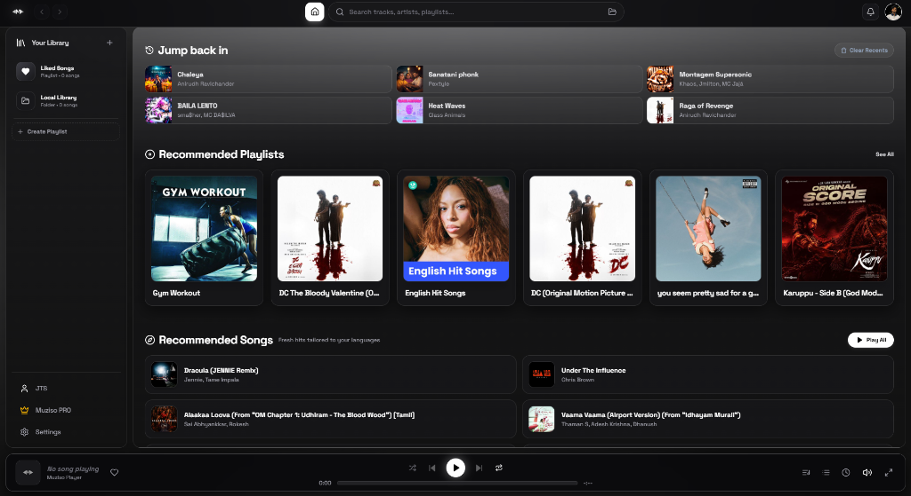
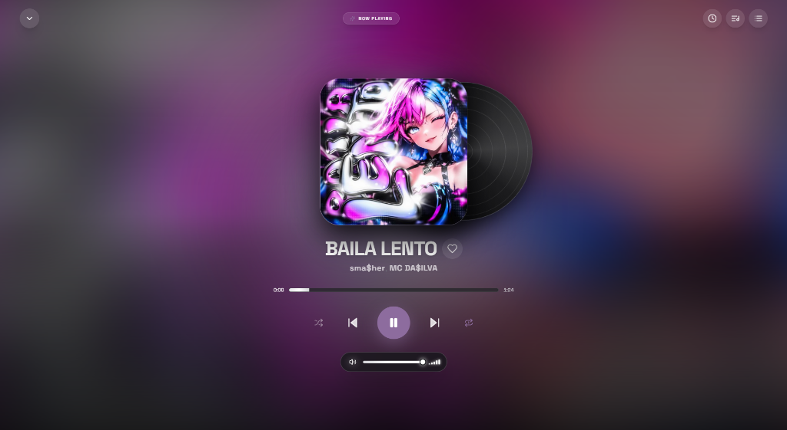
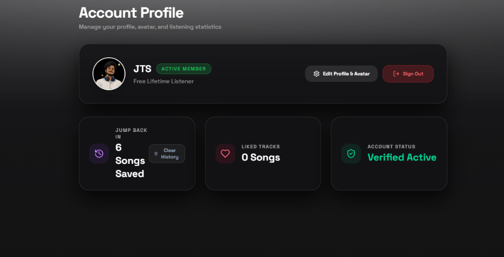
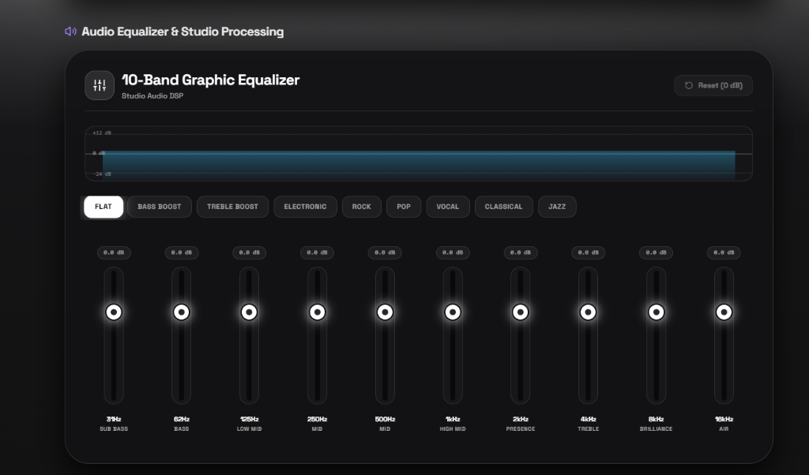
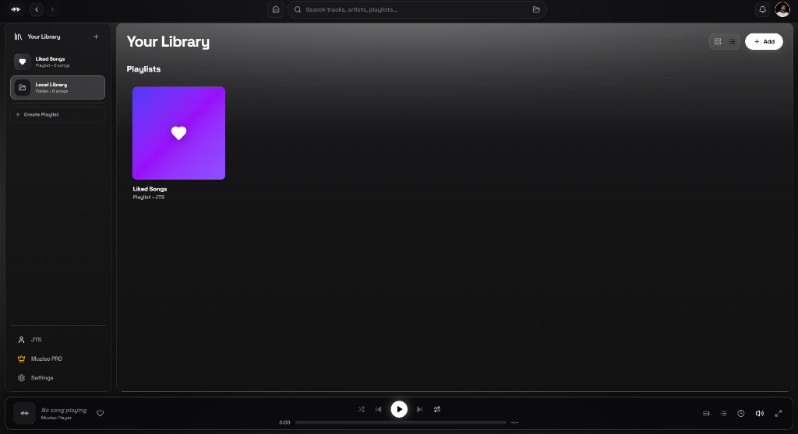

# 🎵 Muziso

<p align="center">
  
</p>

<p align="center">
  
</p>

<p align="center">
  <a href="https://xtros.github.io/Muziso/"></a>
  <a href="https://github.com/xtros/Muziso/releases"></a>
  <a href="https://github.com/xtros/Muziso/blob/main/LICENSE"></a>
  
  
  
</p>

<p align="center">
  <b>Muziso</b> is a premium, dark-themed, desktop music player built for modern listeners. Powered by a high-performance <b>React 19 (TypeScript)</b> + <b>Rust (Tauri v2)</b> engine, Muziso combines sub-30ms 320 kbps JioSaavn direct streaming, smart version-preserving deduplication, guaranteed official album artwork, local library playback, and offline caching.
</p>

<p align="center">
  📖 <b><a href="https://xtros.github.io/Muziso/">Visit the Live GitHub Documentation Web Page</a></b>
</p>

---

## 📚 Documentation & Legal Links

- 🌐 **[GitHub Pages Documentation Site](https://xtros.github.io/Muziso/)**: Interactive documentation, feature breakdowns, and live release notes.
- 🏗️ **[Architecture Guide](docs/ARCHITECTURE.md)**: Deep dive into Tauri IPC, JioSaavn 320kbps CDN resolver, GStreamer audio pipeline, SQLite persistence, and yt-dlp sidecar integration.
- ⚡ **[Installation & Build Guide](docs/INSTALLATION.md)**: Detailed setup steps for Windows, macOS, and Linux.
- 🤝 **[Contributing & Bug Hunter Program](docs/CONTRIBUTING.md)**: Guidelines for code contributions and bug bounty rewards.
- 🔒 **[Privacy Policy](docs/PRIVACY.md)**: Privacy commitment, 100% local database storage, zero telemetry disclosure.
- ⚖️ **[Terms & Conditions](docs/TERMS.md)**: Terms of service, open-source licensing, and third-party media disclaimers.

---

## 🌟 Key Features (v0.1.8)

- ⚡ **JioSaavn Direct 320 kbps Streaming**: Instant sub-30ms CDN audio resolution (`song.getDetails&pids={id}`) for JioSaavn tracks, Search results, Recommended Songs, and Playlists.
- 🔄 **Smart Version-Preserving Deduplication**: Automatically collapses identical song re-releases across compilation albums while preserving legitimate alternate versions & language dubs (`Remix`, `Unplugged`, `Acoustic`, `Lofi`, `Tamil`, `Telugu`, `Hindi`, `Malayalam`, `Kannada`).
- 🎨 **Guaranteed Official High-Res Cover Engine**: Deep artwork metadata extraction paired with an automatic Spotify **640x640 official cover resolver** for every track across the app.
- 👨‍🎤 **Official Artist Discography Sourcing**: Artist Pages query official studio albums and singles exclusively (`include_groups=album,single`), filtering out third-party playlists and compilations.
- 🎶 **Autoplay Queue & Recommended "Play All"**: View upcoming autoplay recommendations inside the Play Queue drawer and start playing all recommended tracks with 1 click.
- 🎧 **Hybrid Audio Engine**: Play local music collections (`.mp3`, `.m4a`, `.wav`, `.opus`, `.flac`) alongside dynamic online streams.
- 📥 **Offline Download & Library Management**: Save tracks locally for immediate offline playback with custom metadata and artwork indexing.
- 🎨 **Cyber-Minimal UI**: High-fidelity dark mode with signature neon branding (`#ccff00`), smooth Framer Motion transitions, custom modal overlays, and responsive routing resets.

---


---


---

## 🎧 Immersive Fullscreen Audio Player

<p align="center">
  
</p>

- 🌌 **Ambient Dynamic Artwork Blur**: Real-time ambient background glow matching the colors of the active track artwork.
- 💿 **3D Vinyl Record Animation**: Interactive spinning vinyl disc popping out behind high-res cover art.
- 🎛️ **Full Playback Controls**: Scrubber timeline, volume controller, shuffle/repeat toggles, queue drawer, and history shortcuts.


---


---

## 👤 Account Profile & Listening Statistics

<p align="center">
  
</p>

- 🛡️ **Account & Avatar Customization**: Custom user profile picture, avatar uploader, and active membership status badge.
- 📊 **Real-time Listening Statistics**: Live counters tracking saved recent tracks, total liked songs, and active account verification.
- 🔑 **Secure Authentication & Management**: Instant 1-click Sign Out, profile editing, and local session management.

## 🎚️ 10-Band Graphic Equalizer & Studio DSP Processing

<p align="center">
  
</p>

- 🎛️ **10-Band Precision Control**: Fine-tune frequencies from 31Hz (Sub Bass) to 16kHz (Air) with real-time (+12 dB / -24 dB) gain adjustments.
- 📊 **Real-time Frequency Response Curve**: Live visual feedback graph illustrating your acoustic output curve.
- 🎚️ **Built-in Studio Presets**: 1-click preset switching including `Flat`, `Bass Boost`, `Treble Boost`, `Electronic`, `Rock`, `Pop`, `Vocal`, `Classical`, and `Jazz`.

## 📂 Your Library & Custom Playlists

<p align="center">
  
</p>

- 📁 **Local Music Import**: Import local music folders (`.mp3`, `.m4a`, `.flac`, `.wav`, `.opus`) with automatic tag indexing.
- ❤️ **Liked Songs**: Instant 1-click favorite song bookmarking saved directly to your local database.
- ➕ **Custom Playlists**: Create, reorder, and manage custom playlists with personalized covers.

## ⚡ Download & Installation

Visit the **[Muziso Releases Page](https://github.com/xtros/Muziso/releases)** to grab the latest standalone installer (`v0.1.8`) for your system:

| Platform | Package Format | Download Link |
| :--- | :--- | :--- |
| **Windows** | `.exe` / `.msi` / `.zip` | [Latest Windows Release (v0.1.8)](https://github.com/xtros/Muziso/releases/latest) |
| **macOS** | `.dmg` / `.app` | [Latest macOS Release (v0.1.8)](https://github.com/xtros/Muziso/releases/latest) |
| **Linux** | `.deb` / `.AppImage` | [Latest Linux Release (v0.1.8)](https://github.com/xtros/Muziso/releases/latest) |

> [!NOTE]
> **Windows SmartScreen Notice**: Because Muziso is an open-source binary without a paid commercial certificate, Windows Defender SmartScreen may display an *"Unknown Publisher"* prompt on first launch. Click **"More info"** &rarr; **"Run anyway"** to continue.

---

## 🛠️ Tech Stack & Architecture

- **Frontend Core**: React 19, TypeScript, Framer Motion, Lucide Icons, Cyber-Minimal Design System
- **Desktop Architecture**: Tauri v2 (Rust)
- **Audio Pipeline**: JioSaavn 320kbps CDN Resolver + GStreamer (Native Rust FFI) + Rodio
- **Artwork Engine**: Spotify Official 640x640 Web API Cover Resolver + JioSaavn 500x500 Image Extractor
- **Local Persistence**: SQLite (`rusqlite`) for library indexing, play counts, and queue state
- **Stream Engine**: `yt-dlp` packaged as a platform-decoupled sidecar binary

---

## 🚀 Development Setup

For complete, step-by-step developer build instructions across all platforms, see **[INSTALLATION.md](docs/INSTALLATION.md)**.

```bash
# 1. Clone the Repository
git clone https://github.com/xtros/Muziso.git
cd Muziso

# 2. Install Frontend Dependencies
npm install

# 3. Run Development Server
npm run tauri dev
```

---

## 🎯 Bug Hunter Reward Program

Found a functional bug, stream error, or UI glitch in **Muziso**? Help improve the platform and get rewarded! See **[CONTRIBUTING.md](docs/CONTRIBUTING.md)** for issue templates and guidelines.

---

## 📜 License & Legal

- **Software License**: Distributed under the MIT License. See [`LICENSE`](https://github.com/xtros/Muziso/blob/main/LICENSE) for details.
- **Privacy Policy**: See **[PRIVACY.md](docs/PRIVACY.md)** for data handling details.
- **Terms & Conditions**: See **[TERMS.md](docs/TERMS.md)** for user agreements and media disclaimers.
